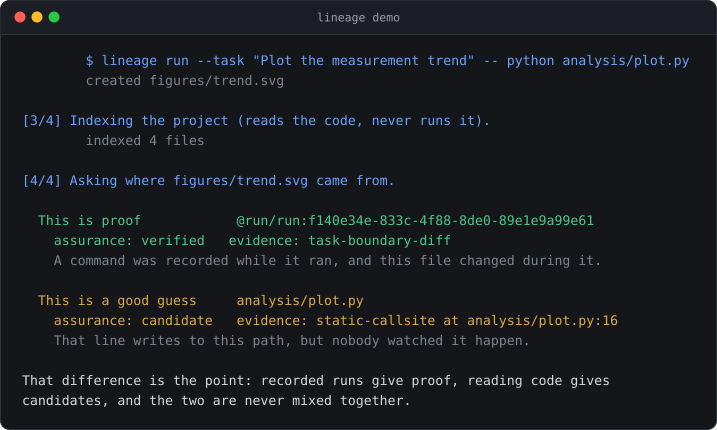

<div align="center">

# Trace File Lineage

**查清一个文件是哪个脚本、notebook、数据、命令或者 AI agent 产出的 —— 完全本地,
带证据,并且如实说明不确定性。**

[📖 文档](docs/skill.md) • [🎯 视角](docs/skill.md#choosing-a-view) • [⚖️ 和 DVC / Git 的区别](docs/comparison.md) • [📊 真实项目实测](docs/real-world-validation.md)

[](https://github.com/uczltw6/trace-file-lineage/actions/workflows/ci.yml)
[](https://pypi.org/project/trace-file-lineage/)
[](https://www.python.org/)
[](LICENSE)

[English](README.md) • [简体中文](README-zh.md)

<picture>
  <source media="(prefers-color-scheme: dark)" srcset="docs/assets/demo-dark.svg">
  <source media="(prefers-color-scheme: light)" srcset="docs/assets/demo-light.svg">
  
</picture>

</div>

为 Python 和 notebook 工作流设计:科研代码、数据分析,以及 AI coding agent 现在
成批产出的那些文件。

```bash
pip install trace-file-lineage
lineage demo
```

`lineage demo` 会建一个小项目、记录一次运行、然后把答案给你看 —— 不到一秒,
零配置,只往 `./lineage-demo` 里写东西。上面那张图就是这条命令的真实输出。

---

## 它做的是两件不同的事

这一点先说清楚,因为两者给出的答案性质不同:

**对于已经存在的文件** —— 重建最可能的来源,并把证据摆出来。不需要你提前做任何设置,
也不需要有什么东西一直在后台跑。这类答案是**排过序的推测**,附带推理依据。

**对于从现在开始的运行** —— 包一层命令,自动得到已证实的来源。这类答案是**证据**。

`lineage demo` 一次把两者都展示出来:

```text
[4/4] Asking where figures/trend.svg came from.

  This is proof            @run/run:f140e34e
    assurance: verified   evidence: task-boundary-diff
    A command was recorded while it ran, and this file changed during it.

  This is a good guess     analysis/plot.py
    assurance: candidate   evidence: static-callsite at analysis/plot.py:16
    That line writes to this path, but nobody watched it happen.
```

**推测会被明确标成推测。** 文件名相似、时间戳接近、某行代码提到了这个路径 —— 这些都
不是证据,而且**再多这类线索堆在一起也永远不会变成证据**。当证据确实不足时,答案是
`insufficient`,而不是随便挑一个看起来合理的。

---

## 两种使用方式

**手动模式** —— 随时问,不用配置任何东西:

```bash
lineage explain report.pdf     # 这个文件从哪来的?
lineage views --list           # 选一个视角:项目地图、单个文件、某次运行、重复文件……
lineage layout                 # 这个项目怎么组织的?哪里看起来乱了?
```

**持续模式** —— 用于你正在开发的项目:

```bash
lineage enable
```

这会往项目的 `CLAUDE.md` 和 `AGENTS.md` 里写入一条**强制要求**,让 agent 在**每次**
任务结束后都记录一次边界,而不是碰巧想起来才做;同时要求它按项目已有的惯例放新文件。
从此以后新产生的文件拿到的是 `verified`,而不是推测出来的猜测。

`lineage status` 看是否开启;`lineage disable` 只删掉它加的那一块,别的一个字不动。

这是一条**指令,不是强制机制** —— 比指望 agent 想起某个 skill 可靠得多,比 lifecycle
hook 不可靠。细节和完整视角列表见 [docs/skill.md](docs/skill.md)。

---

## 为什么需要它

**Git 记录的是版本,不是文件从哪来的。** 它没法告诉你四个 notebook 里是哪一个产出了
那张 PNG,而对于你从来没提交过的文件,它一无所知。

四种典型用途:

| | |
|---|---|
| **往上追** | 找出一个产物背后的代码、notebook、数据、配置或文档 |
| **往下看** | 在改一个输入之前,先知道会影响到什么 |
| **看懂 agent 的产出** | 助手一次写了 150 个文件时,得到一份归好组的摘要,而不是 150 个谜 |
| **从现在开始记录** | 包一次命令,下次的答案就是证据而不是猜测 |

它不是 Git 的替代品,不是构建系统,也不是文件整理工具。
**它从不移动、重命名、修改或删除你的文件。**

---

## 挑一个你想看的角度

`lineage views --list` 会列出全部。这里**刻意没有"那张唯一的图"**,因为每次真正
有用的问题都不一样:

| 你的问题 | 视角 |
|---|---|
| 这个项目里到底有什么? | `project-map` |
| 这个文件从哪来的,又被谁用了? | `file-history` |
| 这份最终报告背后的完整链条是什么? | `source-chain` |
| 这里有哪些多步流水线? | `pipeline` |
| 那次 agent 任务产出了什么? | `agent-run` |
| 哪个脚本画了哪张图? | `code-to-image` |
| 哪个文档导出成了这个 PDF? | `document-export` |
| 有哪些重复文件? | `duplicates` |
| 这是一次参数扫描吗? | `sweeps` |
| 什么时候发生了什么? | `timeline` |
| 哪些文件看起来已经废弃了? | `orphans` |

每个视角都支持 `--format markdown`(默认)、`json`、`mermaid`。

`lineage open` 还会生成一个自包含的交互式关系图:可以拖拽、缩放、点节点看证据。
已证实的关系是实线,推测的是虚线。**完全离线,没有任何网络请求。**

---

## 它到底有多确定

每个答案都带一个标签,而且 CLI 总会告诉你是哪一个:

| 标签 | 大白话 |
|---|---|
| `verified` | 我们看着它发生的。这是证据。 |
| `strong-candidate` | 证据很强,但没人看着它发生。 |
| `candidate` | 一个合理的推测,值得核对。 |
| `weak-signal` | 一点微弱线索。当成方向,别当结论。 |
| `insufficient` | 我们确实不知道,也不打算装作知道。 |

证据优先级:你的确认 → 捕获到的运行 → 可信的导入来源 → 声明 → 静态代码 →
内容与结构 → 命名与时间戳。相关信号不会被重复计算,而且被明确否决过的结论不会被
自动推断复活。

**推测可能是错的。** 在按答案行动之前,先看标签、证据和竞争候选。

---

## 它能读什么

核心**零依赖**,下面这些用一个普通的 Python 3.11+ 就能跑:

- **Python 和 Jupyter notebook** —— 真正解析 AST。notebook 里的 IPython 语法
  (`%matplotlib inline`、`!pip install`、`%%bash`)会先被处理掉再解析。
- **JavaScript / TypeScript** —— 刻意保守的 token 解析,只认直白的情况,不是完整 AST。
- **另外约 50 种文本和代码格式** —— 可索引可搜索,能提取里面写死的路径引用。
- **Word / PowerPoint / Excel / OpenDocument / EPUB** —— 文本、结构、元数据、内嵌图片哈希。
- **PNG / JPEG / TIFF / WebP** —— 图片元数据和指纹。
- **Git** —— 重命名证据。

可选扩展:`pip install 'trace-file-lineage[pdf]'` 加上 PDF 文本和内嵌媒体;本地装了
Tesseract 就能做 OCR。可选部分缺失时会降级成"只有元数据"并明确警告 —— **永远不会
让一次扫描失败**。跑 `lineage doctor` 看你这台机器上的确切支持矩阵。

---

## 你的文件还是你的

- **一切都在本地。** 文件内容永远不会离开你的机器。
- **不涉及任何 AI 服务。** 不需要 OpenAI 或 Anthropic 的 key,不发任何云请求。
- **从不执行你的代码。** Python 文件是被读取和分析的,不是被运行的。
- 密码、密钥、`.env` 文件会自动跳过。
- 记录下来的命令会把看起来像密码的部分抹掉。
- 记录 AI 助手的活动时,只保留一份简短摘要和改动文件列表 —— **不保存**你的对话或 prompt。

有一点值得知道:`.file-lineage/` 目录里含有从你文件中提取的文本,所以请把它当作你的
项目本身来对待。它已经默认被 Git 忽略。完整威胁模型见 [SECURITY.md](SECURITY.md)。

---

## 和 AI coding assistant 一起用

支持 Claude Code 和 Codex,所以你可以直接问助手"这个文件从哪来的",它会用这个工具去查。

```bash
claude --plugin-dir .                                     # Claude Code

ln -s "$PWD/skills/trace-file-lineage" \
      "$HOME/.agents/skills/trace-file-lineage"           # Codex
```

配置细节和其他 host 见 [docs/install.md](docs/install.md)。

---

## 速度

在 macOS + Python 3.14 上测得,可以用 `tests/benchmark.py` 复现:

| 项目规模 | 首次扫描 | 再次检查 | 改动一个文件后 |
|---:|---:|---:|---:|
| 1,000 个文件 | 3.4 秒 | 0.1 秒 | 0.1 秒 |
| 10,000 个文件 | 43 秒 | 1 秒 | 1 秒 |

首次扫描会读全部内容,之后只看变化的部分,所以日常使用几乎是瞬时的。单次查询是
毫秒级。

---

## 状态和局限

**早期版本(0.7.0)。** 能用、有测试,命令仍可能随迭代变化。

- **有时候就是查不到答案。** 如果一个文件的产生过程没有留下任何痕迹,工具会告诉你
  它不知道。这是**正确的答案**,不是失败。
- **Python 支持最好。** JavaScript/TypeScript 是保守处理,其他语言主要是被搜索而不是
  被真正理解。
- **扫描图片里的文字**在 Linux 上验证过,在 macOS 和 Windows 上仍是实验性的。

已在 Python 3.11–3.14 × macOS / Linux / Windows 上测试 —— 十二种组合全部通过。

真实项目实测结果(包括它**没能**证明什么)见
[docs/real-world-validation.md](docs/real-world-validation.md)。
更多局限见 [docs/limitations.md](docs/limitations.md)。

---

## 参与进来

欢迎 issue 和 pull request,包括第一次参与开源的 —— 见
[CONTRIBUTING.md](CONTRIBUTING.md)。发现安全问题请私下报告:[SECURITY.md](SECURITY.md)。

```bash
lineage demo                                          # 看它跑起来
python -m unittest discover -s tests -p 'test_*.py'   # 跑测试
```

## 作者

[tianyiwei](https://github.com/uczltw6) 和 [Claudia Chen](https://github.com/ClaudiaChen04) —— 见 [AUTHORS.md](AUTHORS.md)。

## 许可

MIT。见 [LICENSE](LICENSE)。
