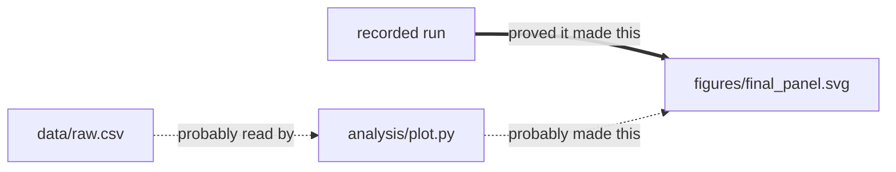

# Trace File Lineage

**"Where did this file come from?"**

You have a chart, a report, a spreadsheet, a dataset. You made it three weeks ago,
or your AI assistant made it ten minutes ago along with 149 others. Now you need to
know which script, which notebook, which input file, or which command actually
produced it.

Trace File Lineage answers that question by reading the files you already have. No
server to run, no account to create, no API key, and nothing you needed to set up
beforehand.

[](https://github.com/uczltw6/trace-file-lineage/actions/workflows/ci.yml)
[](LICENSE)
[](https://www.python.org/)

---

## See it work

```bash
lineage explain figures/final_panel.svg
```

```text
Conclusion: Verified: @run/run:02f95fa9 produced this artifact version.

Target: figures/final_panel.svg

Candidate 1: @run/run:02f95fa9
  Relation: was_generated_by    Assurance: verified    Mode: captured
  Evidence: task-boundary-diff

Candidate 2: analysis/plot.py
  Relation: can_generate        Assurance: candidate   Mode: static
  Evidence: static-callsite at analysis/plot.py:6
```

Read that as two separate statements:

- **Answer 1 is proof.** A command was recorded while it ran, and this file changed
  during it. That is why it says `verified`.
- **Answer 2 is a good guess.** Line 6 of `plot.py` contains code that writes to this
  exact path. Very likely the culprit — but nobody watched it happen, so it says
  `candidate`, not `verified`.

**That distinction is the whole point of this tool.** Plenty of things can hint at where
a file came from: a matching name, a similar timestamp, a line of code that mentions it.
None of those are proof, and Trace File Lineage never quietly upgrades them into proof.
It tells you what it knows, what it suspects, and what it cannot tell you.

---

## Why you might want this

**Git tracks your commits. It does not track where your files came from.** It cannot
tell you which of four notebooks produced a PNG, and it knows nothing at all about the
files you never committed.

Four things people use this for:

| | |
|---|---|
| **Trace a file backwards** | Find the code, data, notebook, or document behind an artifact you no longer remember making. |
| **Look forwards before you break something** | See what depends on an input file *before* you change it. |
| **Make sense of an AI agent's output** | When an assistant writes 150 files in one go, get a grouped summary instead of 150 mystery files. |
| **Record things properly from now on** | Wrap a command once, and next time the answer is proof instead of a guess. |

It is not a replacement for Git, not a build system, and not a file organizer.
**It never moves, renames, edits, or deletes your files.**

---

## Getting started

Requires Python 3.11 or newer. Nothing else — no other packages needed.

```bash
pip install trace-file-lineage
```

> Not on PyPI yet — the first release is being prepared. Until then:
> `pip install git+https://github.com/uczltw6/trace-file-lineage`

Then, in any project folder:

```bash
# "Where did this file come from?"
lineage explain path/to/your/file.png

# "What would I break if I changed this?"
lineage impact data/input.csv

# Run something and record what it changed, so next time you get proof
lineage run --task "Build the report" -- python make_report.py

# Look at everything at once, in your browser
lineage open
```

That is genuinely it. There is no configuration file to write and no setup step. The
first command builds an index automatically, and later commands reuse it. Everything is
stored in a single folder called `.file-lineage/` — delete that folder and nothing else
about your project changes.

Stuck? `lineage --help` lists everything, and `lineage doctor` tells you what your
machine can and cannot read.

---

## Seeing the whole picture

`lineage open` builds an interactive map in your browser — drag it around, zoom in,
click any file to see what's known about it. It's a single self-contained page that
works offline and never sends anything anywhere.

You can also get the same map as a diagram with `lineage export --format mermaid`. Here
is the example above, with the relationship labels written out in plain words:



The tool's own output uses its exact vocabulary in place of those phrases —
`was_generated_by · verified`, `can_generate · candidate`, `declares_read · candidate`.

**Thick solid arrows are proof. Thin dashed arrows are educated guesses.** That rule
holds everywhere — in the browser view, in diagrams, and in the text output.

---

## How sure is it, really?

Every answer comes with one of five labels, and the tool always shows you which:

| Label | In plain words |
|---|---|
| `verified` | We watched this happen. This is proof. |
| `strong-candidate` | Strong evidence, but nobody watched it happen. |
| `candidate` | A reasonable guess worth checking. |
| `weak-signal` | A faint hint. Treat it as a lead, nothing more. |
| `insufficient` | We genuinely don't know, and won't pretend otherwise. |

Stronger evidence always wins over weaker evidence, and — importantly — **piling up
weak hints never adds up to proof.** A hundred files with similar names and similar
timestamps still produce a guess, not an answer.

**Guesses can be wrong.** Look at the label and the evidence before you act on an
answer. If the tool doesn't know, it says so instead of picking something plausible.

---

## What it can read

Everything in this list works with a plain Python install, no extra packages:

- **Python files and Jupyter notebooks** — read properly, by parsing the actual code.
  This is the deepest level of understanding available.
- **JavaScript and TypeScript** — read cautiously. Straightforward cases only, not a
  full understanding of the language.
- **About 50 other text and code formats** — searchable, and file paths mentioned inside
  them get picked up.
- **Word, PowerPoint, Excel, OpenDocument, EPUB** — text, structure, and embedded images.
- **PNG, JPEG, TIFF, WebP** — image details and fingerprints.
- **Git history** — to follow files that were renamed.

Optional add-ons: `pip install 'trace-file-lineage[pdf]'` for reading PDFs, and a local
Tesseract install for reading text inside scanned images. If something optional is
missing, that file is still indexed with a clear note — a scan never fails because of it.

It can also exchange data with W3C PROV, DVC, and OpenLineage, and export to Obsidian.
None of that is required, and you can ignore all of it.
Details: [docs/adapters.md](docs/adapters.md).

---

## Your files stay yours

- **Everything happens on your machine.** Nothing is uploaded, ever.
- **No AI service is involved.** No OpenAI or Anthropic key, no cloud calls.
- **Your code is never executed.** Python files are read and analysed, never run.
- Passwords, keys, and `.env` files are skipped automatically.
- Recorded commands have things that look like passwords stripped out.
- When your AI assistant's activity is recorded, only a short summary and the list of
  changed files is kept — never your conversations or prompts.

One thing worth knowing: the `.file-lineage/` folder contains text pulled out of your
files, so treat it like your project itself. It is excluded from Git automatically.
Full detail: [SECURITY.md](SECURITY.md).

---

## Using it with an AI coding assistant

Works with Claude Code and Codex, so you can just ask your assistant "where did this
file come from?" and it will use this tool to find out.

```bash
claude --plugin-dir .                                     # Claude Code

ln -s "$PWD/skills/trace-file-lineage" \
      "$HOME/.agents/skills/trace-file-lineage"           # Codex
```

Setup details and other hosts: [docs/install.md](docs/install.md).

---

## Speed

Measured on macOS with Python 3.14, and reproducible with `tests/benchmark.py`:

| Project size | First scan | Checking again | After one file changed |
|---:|---:|---:|---:|
| 1,000 files | 3.4 seconds | 0.1 seconds | 0.1 seconds |
| 10,000 files | 43 seconds | 1 second | 1 second |

The first scan reads everything. After that it only looks at what changed, so day-to-day
use feels instant. Individual questions are answered in milliseconds.

---

## Honest limitations

**This is an early release (0.7.0).** It works, it is tested, and commands may still
change as it improves.

- **Sometimes there is no answer to find.** If a file was created without any record and
  left no trace, the tool will tell you it doesn't know. That is the correct answer, not
  a failure.
- **Python is understood best.** JavaScript and TypeScript are handled cautiously, and
  other languages are searched rather than truly understood.
- **Reading text inside scanned images** is tested on Linux and still experimental on
  macOS and Windows.

Tested on Python 3.11 through 3.14 across macOS, Linux, and Windows — all twelve
combinations passing. More: [docs/limitations.md](docs/limitations.md) and
[docs/compatibility.md](docs/compatibility.md).

---

## Help out

Bug reports and pull requests are welcome, including from first-time contributors —
[CONTRIBUTING.md](CONTRIBUTING.md) explains the layout and how to run the tests.
Found a security problem? Please report it privately: [SECURITY.md](SECURITY.md).

```bash
python -m unittest discover -s tests -p 'test_*.py'
```

## License

MIT — use it for anything. See [LICENSE](LICENSE).
