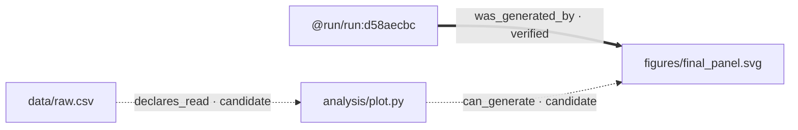

# Trace File Lineage

**Your agent just wrote 150 files. Which one came from where?**

[](https://github.com/uczltw6/trace-file-lineage/actions/workflows/ci.yml)
[](https://pypi.org/project/trace-file-lineage/)
[](https://pypi.org/project/trace-file-lineage/)
[](LICENSE)

Trace File Lineage answers "where did this file come from?" for local workspaces —
without a server, a vendor API key, or any prior instrumentation. It reads the code,
documents, images, Git history, and command runs you already have, builds a local
evidence graph, and ranks the likely ancestry while keeping the alternatives.

```bash
pip install trace-file-lineage
lineage explain figures/final_panel.svg
```

```text
Status: ok
Conclusion: Verified: @run/run:d58aecbc produced this artifact version.

Target: figures/final_panel.svg

## Candidate 1: @run/run:d58aecbc
- Relation: was_generated_by    Assurance: verified    Mode: captured
- Evidence: task-boundary-diff

## Candidate 2: analysis/plot.py
- Relation: can_generate        Assurance: candidate   Mode: static
- Evidence: static-callsite at analysis/plot.py:6
```

The key idea: **captured facts and historical guesses never get mixed.** A wrapped
command run is `verified`. A static call site is a `candidate`. Matching timestamps
are a `weak-signal` and never get promoted, no matter how many of them pile up.

## Why this exists

Agents and scripts produce files faster than anyone can track them. Three weeks later
you have a PNG, a report, or a dataset and no idea which script, notebook, config, or
agent task made it. Git tracks commits, not the causal path from input to artifact —
and it says nothing about the files you never committed.

- **Trace an artifact back** to the code, notebook, dataset, config, or document behind it.
- **See downstream impact** before you change an input.
- **Summarize an agent run** that scattered hundreds of files, grouped instead of drawn as hundreds of equal nodes.
- **Record future runs** so the next question has a verified answer instead of a guess.

This is not Git, a scheduler, or a file organizer. It never moves or modifies your source files.

## Try it in 30 seconds

```bash
pip install trace-file-lineage

# Retrospective: explain a file that already exists.
lineage explain path/to/artifact.png

# Prospective: record what a command changes, and keep its exit code.
lineage run --task "Render figures" -- python analysis/plot.py

# What breaks if I change this input?
lineage impact data/raw.csv

# Browse the whole graph in a local, offline HTML explorer.
lineage open
```

`lineage explain` refreshes the incremental index and answers in one command.
No config file, no daemon, no account. The index lives in `.file-lineage/`;
delete that directory and nothing else changes.

## The graph

`lineage open` writes a self-contained HTML explorer — a force-directed graph with
search, assurance filtering, and per-edge evidence. Captured relationships are solid;
inferred ones are dashed. No server, no CDN, no network request.

`lineage export --format mermaid` gives you the same graph as text. This is the real
output for the four-file demo above:



Thick solid arrows are captured; dashed arrows are inferred.

## Assurance levels

Every claim carries one of these, and the CLI always tells you which:

| Assurance | What it means |
|---|---|
| `verified` | A wrapped run, trusted imported provenance, or your own confirmation supports this |
| `strong-candidate` | Strong evidence, but no verified causal event |
| `candidate` | Useful circumstantial support |
| `weak-signal` | Limited support; treat as a lead |
| `insufficient` | Do not present this as an answer |

Evidence priority: your confirmation → captured runtime → trusted imported provenance →
declarations → static code → content and structure → naming and timestamps. Correlated
signals are not double-counted, and an actively rejected claim cannot be revived by
automatic inference.

**Inference can be wrong.** Check the assurance, evidence, and competing candidates
before acting on an answer.

## Commands

```text
explain FILE        refresh the index and explain one artifact          ← start here
open                render and open the local HTML graph explorer
run -- CMD          wrap a command and record what it changed
impact FILE         what a change to this input would affect
why FILE            rank producer candidates against the current index
find QUERY          fuzzy filename plus indexed-text discovery
stale [FILE]        outputs likely outdated relative to their inputs
receipt [RUN_ID]    complete manifest for a recorded run
doctor              versions, optional dependencies, format coverage
```

Also available: `scan`, `rebuild`, `alternatives`, `path`, `orphans`, `run-show`,
`snapshot`/`record`, `recover`, `reproduce` (dry-run only, never executes),
`confirm`/`reject`/`undo`/`rescore`, `search`, `export`, `import`.
Run `lineage --help` or see [docs/cli.md](docs/cli.md).

## What it can read

The core has **zero dependencies**. Everything below works with a plain Python 3.11+ install:

- **Python and notebooks** — syntax-aware lineage from the AST, including common
  Pandas, NumPy, Matplotlib, PIL, and `pathlib` file I/O patterns.
- **JavaScript/TypeScript** — a deliberately conservative token/static parser for
  literal imports and `fs` calls. Not a full AST or type-aware engine.
- **~50 more text and source formats** — indexed and searchable, with conservative
  literal path references. Not language-level analysis.
- **DOCX, PPTX, XLSX, ODT, ODP, ODS, EPUB** — text, structure, metadata, links, and
  embedded-media hashes.
- **Images** — PNG/JPEG/TIFF/WebP metadata and fingerprints.
- **Git** — rename evidence.

Optional extras: `pip install 'trace-file-lineage[pdf]'` adds PDF text and embedded-media
extraction; a local Tesseract install adds OCR. Missing optional pieces degrade to
metadata-only with an explicit warning — they never fail a scan.
Run `lineage doctor` for the exact matrix on your machine.

Interoperates with W3C PROV (import and export), DVC, OpenLineage, local code-graph
JSON, and Obsidian export. None of them is required. See [docs/adapters.md](docs/adapters.md).

## Privacy

- Analysis is local. No file contents leave your machine.
- The core imports no OpenAI or Anthropic SDK and needs no API key.
- Scanning **never executes** your project code.
- Secrets, credential stores, dependencies, and caches are excluded by default.
- External symlinks are not followed; ZIP-based documents enforce expansion limits.
- Run records store a safe summary and redacted commands — never prompts,
  conversations, transcripts, or environment variables.

## Use it from an agent

One canonical [Agent Skills](https://developers.openai.com/codex/skills)-compatible
skill lives at `skills/trace-file-lineage/SKILL.md`. Claude Code and Codex packages are
thin launchers around the same engine.

```bash
claude --plugin-dir .                                     # Claude Code
ln -s "$PWD/skills/trace-file-lineage" \
      "$HOME/.agents/skills/trace-file-lineage"           # Codex
```

Optional lifecycle hooks record a run boundary per turn. They require host trust,
never block your work, and fail open. See [docs/install.md](docs/install.md).

## Performance

Measured by `tests/benchmark.py` on macOS with Python 3.14 and standard-library adapters:

| Workspace | Cold scan | No change | One file changed | Query p95 |
|---:|---:|---:|---:|---:|
| 1,000 files | 3.4 s | 0.12 s | 0.12 s | 0.8 ms |
| 10,000 files | 43.5 s | 1.08 s | 1.06 s | 6.7 ms |

Your numbers depend on filesystem, file types, and content size.

## Status and limits

**Public alpha.** The API and CLI may still change; releases follow SemVer.

Historical causality can stay genuinely ambiguous without run or Git evidence, and
the tool says so rather than guessing. JavaScript/TypeScript analysis is intentionally
shallow, languages beyond Python are text-indexed rather than parsed, and OCR is
experimental. Full detail: [docs/limitations.md](docs/limitations.md) and
[docs/compatibility.md](docs/compatibility.md).

## Contributing

Issues and pull requests are welcome — see [CONTRIBUTING.md](CONTRIBUTING.md).
Security reports go through [SECURITY.md](SECURITY.md), not public issues.

```bash
python -m unittest discover -s tests -p 'test_*.py'
```

## License

MIT. See [LICENSE](LICENSE).
