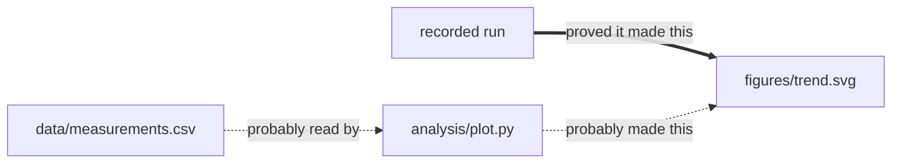

# Trace File Lineage

**Find out which script, notebook, data file, command, or AI agent produced a file —
locally, with evidence, and with honest uncertainty.**

Built for Python and notebook work: research code, data analysis, and the piles of
files AI coding agents now generate.

[](https://github.com/uczltw6/trace-file-lineage/actions/workflows/ci.yml)
[](https://pypi.org/project/trace-file-lineage/)
[](LICENSE)
[](https://www.python.org/)

```bash
pip install trace-file-lineage
lineage demo
```

`lineage demo` builds a small project, records a run, and shows you the answer — under
a second, nothing to configure, and it writes only into `./lineage-demo`.

---

## It does two different things

Being precise about this up front, because they give different kinds of answer:

**For files you already have** — reconstruct the most likely origins and show the
evidence. No setup was needed, and nothing had to be running beforehand. These
answers are ranked guesses with the reasoning attached.

**For runs from now on** — wrap a command and get verified provenance
automatically. These answers are proof.

`lineage demo` shows both at once:

```text
[4/4] Asking where figures/trend.svg came from.

  This is proof            @run/run:8aa88ebd
    assurance: verified   evidence: task-boundary-diff
    A command was recorded while it ran, and this file changed during it.

  This is a good guess     analysis/plot.py
    assurance: candidate   evidence: static-callsite at analysis/plot.py:16
    That line writes to this path, but nobody watched it happen.
```

**Guesses are labelled as guesses.** A matching filename, a nearby timestamp, a line
of code that mentions a path — none of those are proof, and no amount of them stacked
together ever becomes proof. When the evidence genuinely isn't there, the answer is
`insufficient` rather than something plausible.

---

## Two things people use it for

### 1. "Where did this old file come from?"

You have a chart from three weeks ago and no memory of making it.

```bash
lineage explain figures/final_panel.png
```

It reads your code, documents, image metadata, and Git history, then ranks the
candidates and shows the evidence for each. Often the answer is obvious once you see
it — *that* notebook, reading *that* CSV. Sometimes the honest answer is that the
trail is gone.

### 2. "My agent just wrote 150 files"

```bash
lineage run --task "Parameter sweep" -- python sweep.py
lineage receipt
```

Every file that run touched, recorded as proof, grouped rather than dumped as 150
separate mysteries. Works the same for an AI agent's turn as for a script.

Then, before you change an input:

```bash
lineage impact data/raw.csv     # what depends on this
lineage stale data/raw.csv      # what is now out of date
```

---

## The interactive graph

```bash
lineage open
```

An interactive map in your browser: drag, zoom, click a file to focus on just its
neighbourhood and read the evidence behind each link. **Solid arrows are proof,
dashed arrows are guesses.** One self-contained page — offline, no server, nothing
sent anywhere.

`lineage export --format mermaid` gives the same graph as a diagram. Here is the demo
project, with the labels written in plain words:



The tool's own labels are `was_generated_by · verified`, `can_generate · candidate`,
and `declares_read · candidate`.

---

## How sure is it?

Five labels, always shown:

| Label | In plain words |
|---|---|
| `verified` | We watched it happen. Proof. |
| `strong-candidate` | Strong evidence, but nobody watched. |
| `candidate` | A reasonable guess worth checking. |
| `weak-signal` | A faint hint. A lead, nothing more. |
| `insufficient` | We don't know, and won't pretend. |

Order of trust: your own confirmation, then recorded runs, then imported provenance,
then declarations, then static code, then content, then names and timestamps.

---

## Where it's strongest

**Best at:** Python and Jupyter notebooks. Their code is genuinely parsed, so
file reads and writes are understood rather than guessed at — including common
Pandas, NumPy, Matplotlib, PIL, and `pathlib` patterns.

**Good at:** Word, PowerPoint, Excel, OpenDocument, EPUB, and PDF (text, structure,
embedded images); PNG/JPEG/TIFF/WebP metadata; Git rename history; and searching
about 50 text and code formats for file references.

**Deliberately shallow:** JavaScript and TypeScript get a cautious static scan, not
real language understanding. Other languages are searched, not parsed. Spreadsheet
formulas are recorded but not turned into links. Paths built at runtime can't be
resolved.

So it fits research code, data analysis, notebook workflows, Python automation, and
agent-generated artifacts. It is **not** a general-purpose lineage platform for any
software project, and doesn't claim to be.

Run `lineage doctor` for what your own machine can read.

---

## Everything stays local

- **Nothing is uploaded, ever.** No account, no API key, no AI service.
- **Your code is never executed.** It is read and analysed.
- Passwords, keys, and `.env` files are skipped automatically.
- Recorded commands have password-looking arguments stripped.
- From an AI agent, only a summary and the changed-file list is kept — never your
  conversations or prompts.

The `.file-lineage/` folder holds text extracted from your files, so treat it like the
project itself. It's Git-ignored by default. See [SECURITY.md](SECURITY.md).

---

## Speed

Measured on macOS with Python 3.14, reproducible with `tests/benchmark.py`:

| Project size | First scan | Later runs |
|---:|---:|---:|
| 1,000 files | 3.4 s | 0.1 s |
| 10,000 files | 43 s | 1 s |

The first scan reads everything and shows a progress counter; after that only changes
are read. Individual questions answer in milliseconds. `node_modules`, virtual
environments, caches, and build output are skipped by default, and each scan reports
what it left out.

---

## With an AI coding assistant

Ask Claude Code or Codex "where did this file come from?" and it will use this tool.

```bash
claude --plugin-dir .                                     # Claude Code

ln -s "$PWD/skills/trace-file-lineage" \
      "$HOME/.agents/skills/trace-file-lineage"           # Codex
```

Details: [docs/install.md](docs/install.md).

---

## Why not Git, DVC, or OpenLineage?

Short version: Git records *versions*, DVC and OpenLineage record pipelines you
declared in advance, and this records *evidence* — including for work nobody planned
to track. Full comparison, including when **not** to use this:
[docs/comparison.md](docs/comparison.md).

## Integrations — experimental

These exist, are tested against fixtures, and are **not** part of the core promise:
import and export [W3C PROV](docs/adapters.md), read `dvc.yaml`, read OpenLineage
events, import an external code graph, export to Obsidian.

They have fixture-level coverage only and have not been validated against real
third-party pipelines. Treat them as a starting point rather than a compatibility
guarantee, and ignore all of it if you don't need it. The core — tracing files in
your workspace — does not depend on any of them.

---

## Status

**Early release (0.7.0).** Tested on Python 3.11–3.14 across macOS, Linux, and
Windows — all twelve combinations green in CI, plus coverage, linting, and real
PDF/OCR fixtures. Commands may still change.

Run against three externally-authored repositories, with the results and the
defect it uncovered written up in
[docs/real-world-validation.md](docs/real-world-validation.md) — including what
those runs do **not** establish.

Known limits are written down rather than glossed over:
[docs/limitations.md](docs/limitations.md).

## Contributing

Issues and pull requests welcome, including from first-timers —
[CONTRIBUTING.md](CONTRIBUTING.md). Security reports go privately via
[SECURITY.md](SECURITY.md).

```bash
lineage demo                                          # see it work
python -m unittest discover -s tests -p 'test_*.py'   # run the tests
```

## Two ways to use it

**Manual** — ask a question any time, nothing to set up:

```bash
lineage explain report.pdf     # where did this come from?
lineage views --list           # pick an angle: project map, one file, a run, duplicates…
lineage layout                 # how is this project organised, and what looks like drift?
```

**Continuous** — for a project you are actively working in:

```bash
lineage enable
```

That writes a required instruction into the project's `CLAUDE.md` and `AGENTS.md`,
so the agent records a boundary after **every** task instead of when it happens to
remember, and places new files by the project's existing conventions. From then on
new files get `verified` provenance rather than inferred guesses.
`lineage status` shows whether it is on; `lineage disable` removes exactly that block.

It is an instruction, not an enforcement mechanism — more reliable than hoping the
agent recalls a skill, less reliable than a lifecycle hook. Details and the full
view list: [docs/skill.md](docs/skill.md).

## Authors

[tianyiwei](https://github.com/uczltw6) and [Claudia Chen](https://github.com/ClaudiaChen04) — see [AUTHORS.md](AUTHORS.md).

## License

MIT. See [LICENSE](LICENSE).
